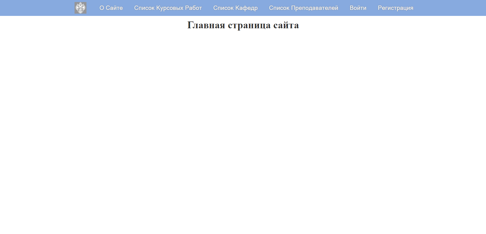
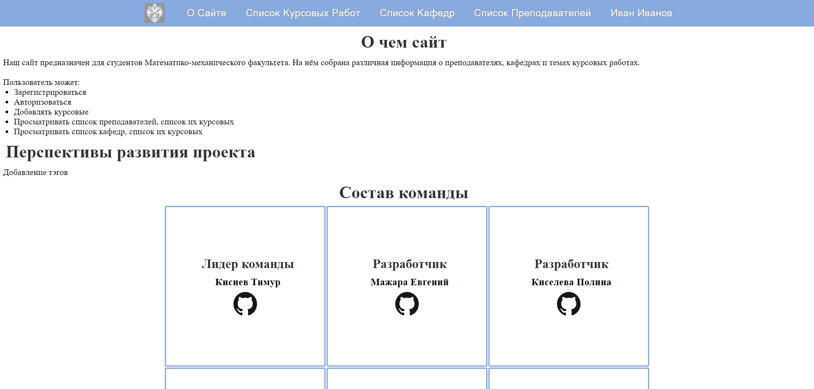
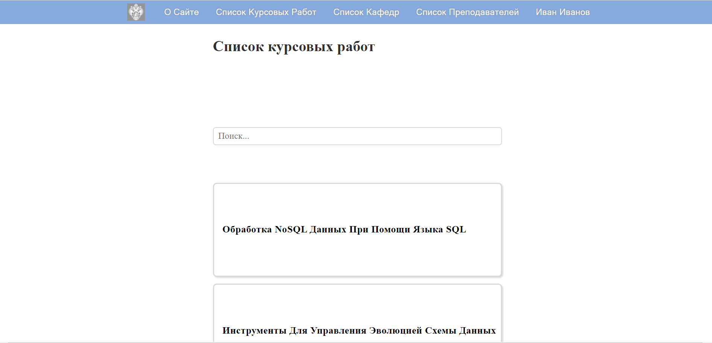
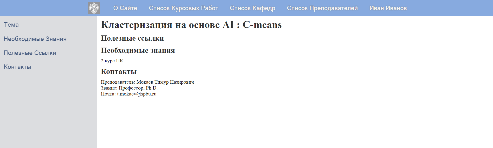
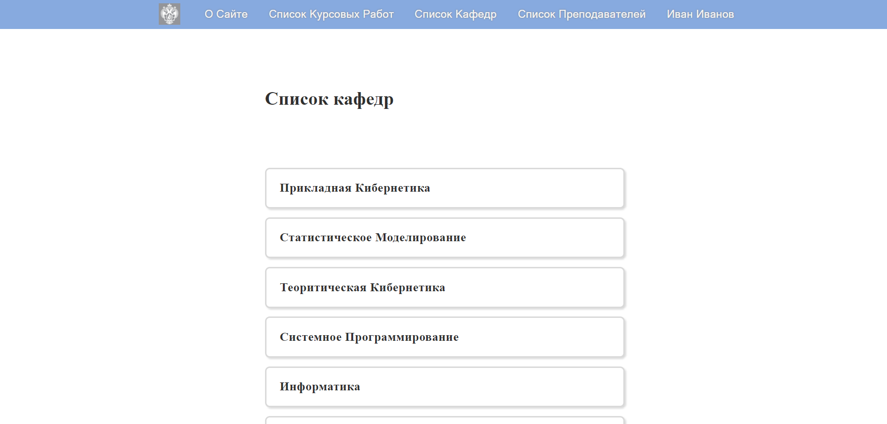
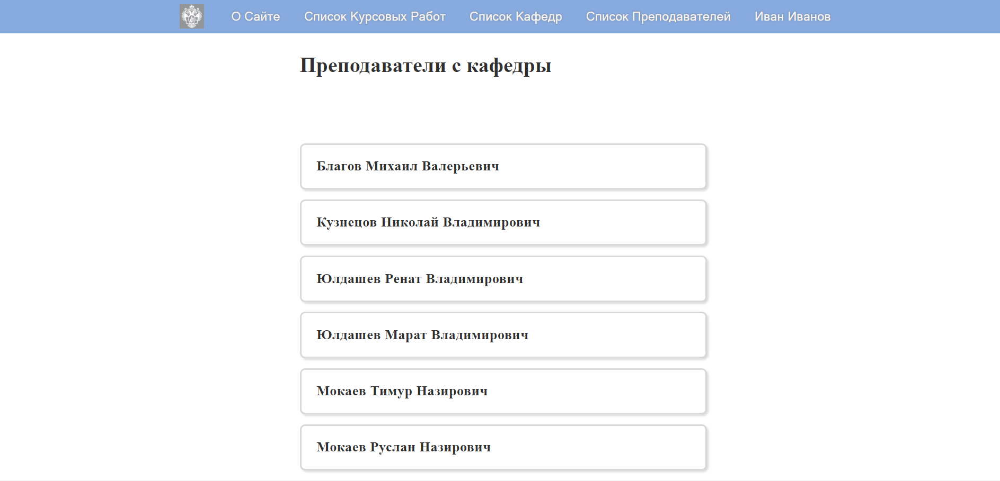
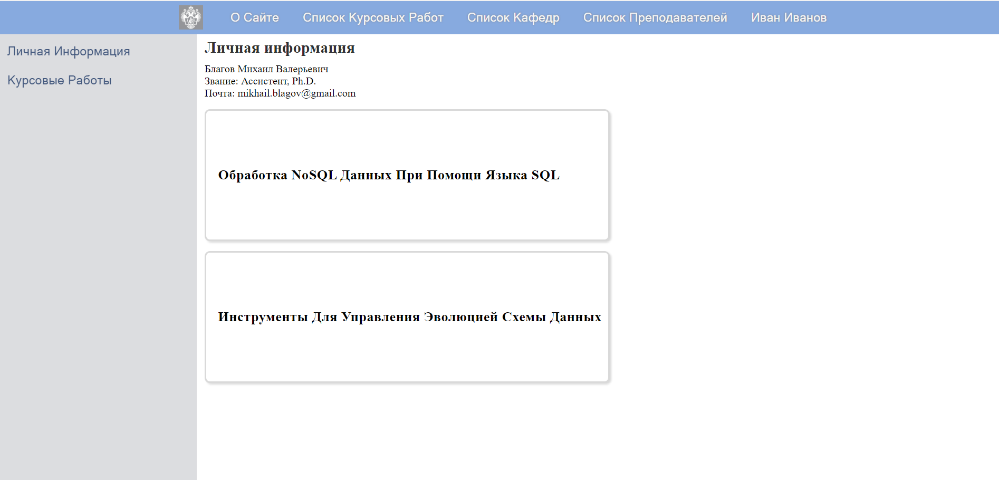
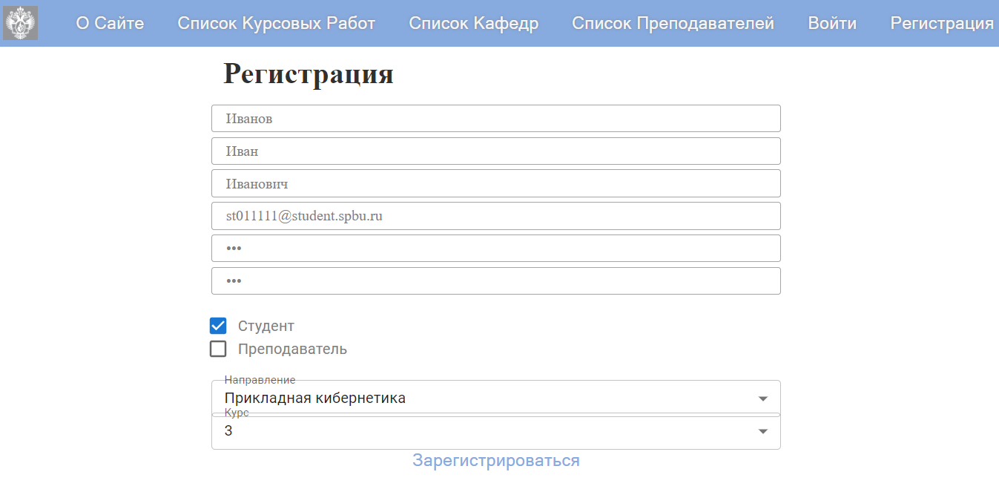
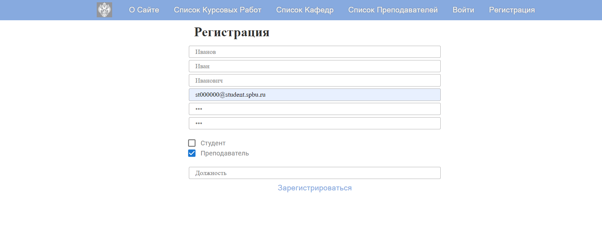
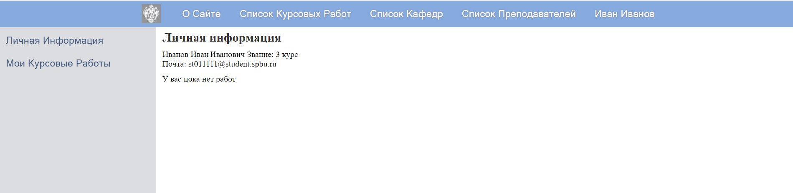

# Site-with-course-works-for-BP

## Основная информация
Наше приложения представляет из себя платформу, содержащую список курсовых работ со всех кафедр математико-механического факультета СПБГУ. В нём можно авторизоваться как преподавателю, так и студенту, а также найти темы и научного руководителя для соответствующего курса. 

## Запуск локальной версии
Приложение работает на основе двух подов Kubernetes. Чтобы запустить его на локальном устройстве, необходимо выполнить следующие шаги
1. Установить Minikube, инструмент для запуска одноузлового кластера Kubernetes на виртуальной машине в персональном компьютере
2. Командой `minikube start --driver=docker` запустить Minikube
3. Запустить контроллер для маршрутизации командой `minikube addons enable ingress`
4. Запустить скрипт командой `kubectl apply -f *путь до .yaml файла с конфигурацией*`
5. Дождаться пока все поды не будут в состоянии Running (контролируется командой `kubectl get po --watch`), а также, пока ingress не присвоится ip-адресс (контролируется командой `kubectl get ing --watch`)
6. Открыть второе консольное окно и создать точку входа командой `minikube tunnel`
7. В браузере подключиться к порту `localhost:80`

## Обзор функционала
При запуске нас встречает главная страница

В верхней панели наблюдаем несколько разделов

### Раздел о сайте

### Раздел Список Курсовых Работ

Тут мы можем также посмотреть различную информацию о конкретной курсовой работе (панель с разделами слева перекидывает нас на соответствующую часть страницы)

### Раздел Кафедр 

Можем посмотреть отдельные кафедры и их преподавателей

А у преподавателей их курсовые работы и личную информацию

### Регистрация
Здесь мы можем зарегистрироваться в роли студента

Или в роли преподавателя

После регистрации нас перенаправит в личный кабинет

## Используемые технологии
- Java 18
- Maven
- Spring
- PostgreSQL
- K8s